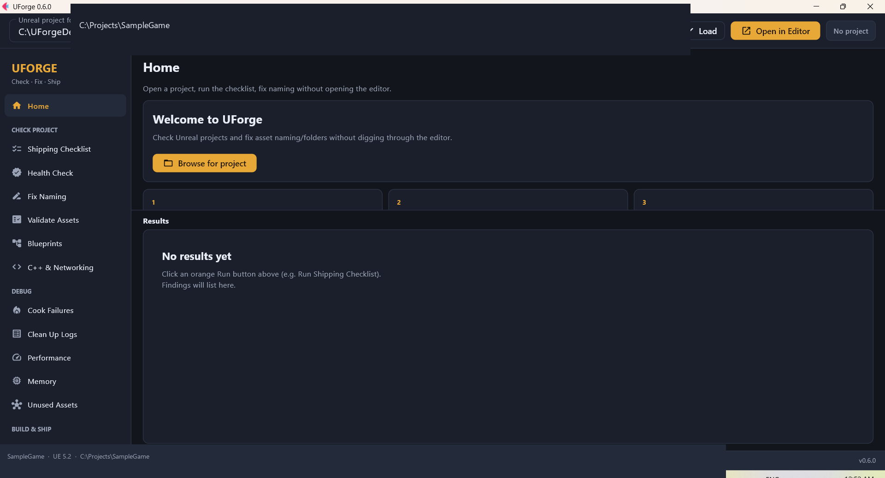
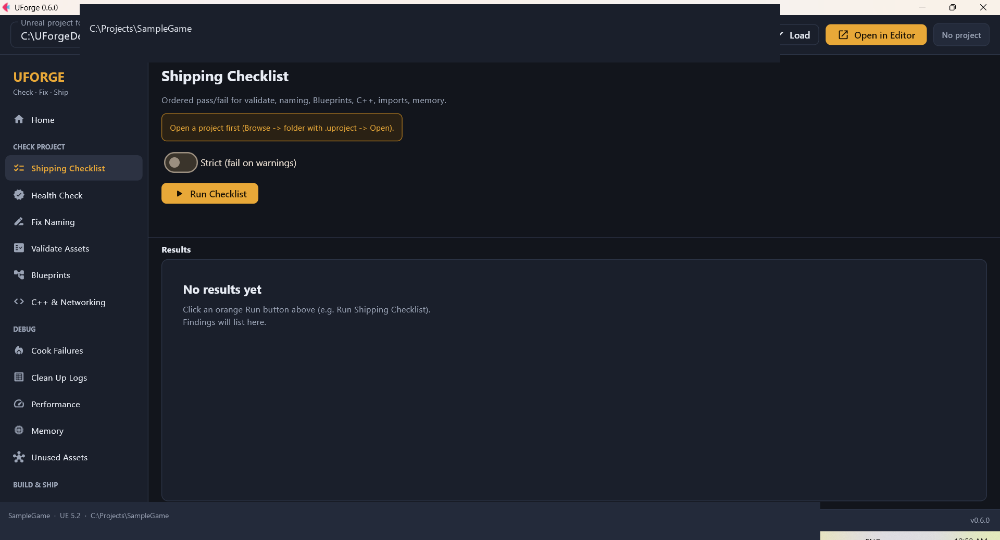

# UForge Builds

**Developed by [Pratik Kuratkar](https://github.com/baymax-pratik)**

Portable **Windows builds** of **UForge** — a desktop suite for Unreal Engine developers.

> **Source code:** [baymax-pratik/UForge](https://github.com/baymax-pratik/UForge)  
> **This repo:** downloads, screenshots, and product docs for the packaged app only.

---

## What is UForge?

UForge is an **offline / near-offline Unreal project toolkit**. You point it at a folder that contains a `.uproject`, then run focused tools from a simple desktop UI.

It helps you:

- Catch bad asset names, missing prefixes, and folder layout issues  
- Run a **shipping checklist** before you cook or package  
- Spot Blueprint tick problems and common C++ / replication mistakes  
- Diagnose **cook failures** from logs  
- Estimate texture/memory budgets and triage noisy logs  
- Open the loaded project in Unreal Editor with one click  
- **Fix naming** automatically (including renames that need UnrealEditor-Cmd)

UForge does **not** replace Unreal Editor. It does **not** edit your C++ source when renaming assets.

---

## Who it’s for

| Audience | Why use UForge |
|----------|----------------|
| Indie / solo UE developers | Fast health checks without digging through Content Browser |
| Small studios | Shared naming rules via `.uforge/naming_rules.json` |
| Tech artists / producers | Shipping checklist + cook log triage |
| Engineers | Blueprint/C++ lint signals and config diffs |

---

## Download (v0.6.0)

Get the latest package from **[Releases](https://github.com/baymax-pratik/UForge-Builds/releases)**.

| File | Platform | Size (approx.) |
|------|----------|----------------|
| [`UForge-0.6.0-win64.zip`](https://github.com/baymax-pratik/UForge-Builds/releases/download/v0.6.0/UForge-0.6.0-win64.zip) | Windows 10/11 **64-bit** | ~68 MB |

### Install

1. Download the zip from Releases  
2. Unzip anywhere (portable — no installer)  
3. Run **`Launch UForge.bat`** or **`UForge.exe`**

Only **one** UForge window can run at a time (single-instance lock).

---

## Requirements

| Requirement | Notes |
|-------------|--------|
| Windows 10 or 11 (64-bit) | Required for this build |
| Unreal project folder | Must contain a `.uproject` and usually a `Content/` folder |
| Unreal Engine (recommended) | Needed for **Open in Editor** and **Fix Naming → Apply** when names get longer (e.g. `Enemy` → `BP_Enemy`) |

Engine versions are auto-detected from Epic installs (e.g. UE 5.2). Match your project’s `EngineAssociation` when possible.

---

## Quick start

1. Launch UForge  
2. **Browse** to your Unreal project folder (the one with `.uproject`) → **Load**  
3. Use the sidebar:  
   - **Shipping Checklist** — ordered pass/fail overview  
   - **Fix Naming** — scan, then apply studio prefixes/folders  
   - **Validate Assets**, **Blueprints**, **C++ & Networking**, etc.  
4. Read findings in the **Results** panel (export JSON / Markdown / CSV when available)  
5. Optionally click **Open in Editor** to launch Unreal with that project  

---

## Features (v0.6.0 desktop)

### Check Project

| Tool | What it does |
|------|----------------|
| **Shipping Checklist** | Runs validate + naming + Blueprints + C++ + import + memory style checks in one pass |
| **Health Check** | High-level project health summary |
| **Fix Naming** | Scans Content against `.uforge/naming_rules.json` (e.g. `BP_`, `SM_`, `T_`). Apply renames offline when safe; longer names via **UnrealEditor-Cmd**. Never edits C++ |
| **Validate Assets** | Spaces / bad characters; deep mesh collision & LOD heuristics |
| **Blueprints** | Tick / expensive pattern lint |
| **C++ & Networking** | UPROPERTY/UFUNCTION style + replication sheet |

### Debug

| Tool | What it does |
|------|----------------|
| **Cook Failures** | Parse cook / UAT logs → missing assets and errors (optional watch mode) |
| **Clean Up Logs** | Triage / spam grouping for Output Logs |
| **Performance** | Insights CSV / hitch-oriented reports |
| **Memory** | Texture size budget estimates |
| **Unused Assets** | Heuristic orphan / reference exploration |

### Build & Ship

| Tool | What it does |
|------|----------------|
| **Build / Cook** | Run saved UAT presets (dry-run first; optional real execute) |
| **Config Diff** | Compare Default vs platform ini settings |
| **Import / Data / Loc** | Import name presets, DataTable↔CSV sync, localization checks |

### App shell

- Recent projects  
- Strict mode (fail on warnings)  
- **Open in Editor** (resolves engine from `EngineAssociation`)  
- Single-instance lock  
- Clickable findings (open folder / copy path / export report)

---

## Fix Naming — how to use it properly

This is the feature people test most often. Offline file renames alone **do not** update names Unreal shows in Content Browser when the new `/Game/...` path is **longer**.

**Correct workflow:**

1. **Close** the Unreal Editor (interactive)  
2. In UForge: **Fix Naming → Scan Problems**  
3. Turn **ON** “Apply fixes…”  
4. Click **Apply Fixes** (may take 1–2 minutes; launches UnrealEditor-Cmd in the background)  
5. Re-open the project in Unreal — names should match (e.g. `Enemy` → `BP_Enemy`)

Rules live in your project at:

```text
YourGame/.uforge/naming_rules.json
```

Edit prefixes and target folders there. C++ is never modified.

---

## Screenshots

Fullscreen UI captures with **sanitized** sample paths (`C:\Projects\SampleGame`).

### Home


### Project loaded



### Fix Naming



### Shipping Checklist


---

## What’s included in the zip

```text
UForge-0.6.0-win64/
├── Launch UForge.bat    ← start here
├── UForge.exe
├── README.txt
└── _internal/           ← runtime (do not delete)
```

---

## FAQ

**Do I need Python?**  
No. The Windows build is self-contained.

**Will Fix Naming change my C++?**  
No. Only Content assets / package paths (and references when safe).

**Why did Apply do nothing?**  
Usually: Apply switch was off, Unreal Editor was still open, or no matching rule. Scan first and read the Results hints.

**Where is the CLI / MCP?**  
In the [source repository](https://github.com/baymax-pratik/UForge) (`uforge`, `uforge-mcp`). This build ships the **desktop app**.

**Can I use this commercially?**  
MIT license — see the source repo. Use at your own risk; always back up projects before Apply.

---

## Version history

### v0.6.0

- First public Windows portable build  
- Open in Editor  
- Editor-backed Fix Naming for longer package paths  
- Shipping checklist + Check / Debug / Build tool groups  
- Single-instance lock  
- Results panel with export helpers  

---

## Links

| | |
|--|--|
| **Download releases** | https://github.com/baymax-pratik/UForge-Builds/releases |
| **Source code** | https://github.com/baymax-pratik/UForge |
| **Roadmap / architecture** | see `ROADMAP.md` and `docs/` in the source repo |
| **Bug reports / features** | [Issues on the source repo](https://github.com/baymax-pratik/UForge/issues) |

---

## Author / Developer

**Pratik Kuratkar** ([@baymax-pratik](https://github.com/baymax-pratik))

## License

MIT — same as [UForge](https://github.com/baymax-pratik/UForge).
